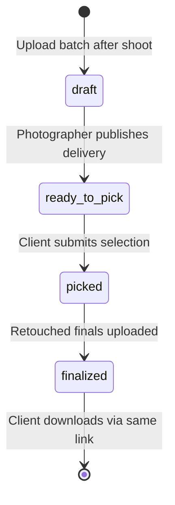

# Vega — product definition

**Vega** is Menhir’s photo portfolio platform for students and working photographers. One workspace, two modes, one album model.

| Mode | Role | Device | What it does |
|------|------|--------|--------------|
| **Portfolio builder** | Photographer | **Desktop** | Controller + live preview → publish site to **URL of their choosing** |
| **Delivery** | Client + photographer | Client: **mobile web** · Photographer: **desktop** | Private album link → pick → retouch loop → one-click finals download |

Hosted at **https://vega.menhir-holdings.com**. Published portfolios can use `{slug}.vega.menhir-holdings.com` or a custom domain.

BOB is deprecated; deploy plumbing migrates here. See [BOB-MIGRATION.md](./BOB-MIGRATION.md).

---

## Core loop (shoot → deliver)



### 1. Shoot → ingest (admin, desktop)

After a session, the photographer uploads a **batch** (local folder, ZIP, or Google Drive folder) in **Admin**.

- Creates a new **album** (or appends to an existing one for the same project).
- All files land in an **uncategorized pile** or auto-map from folder names.
- Photographer **curates**: show/hide per image, drag order, assign categories, set cover.

### 2. Visibility (same album, two audiences)

| Setting | Portfolio site | Delivery link |
|---------|----------------|---------------|
| **Public** | Visible in published site | — |
| **Private** | Hidden from site | Client link only |
| **Both** | On portfolio + deliverable | Optional separate delivery pass |

Private albums are how wedding/portrait clients get proofs without exposing work on the public site.

### 3. Delivery link (client, mobile)

Photographer sets album state to **`ready_to_pick`** and shares one link (optional PIN).

Client experience on phone:

- Album / category tabs
- Browse proofs (watermarked or low-res previews)
- Heart or number picks (optional max, e.g. 30 of 400)
- Optional per-image note (“skin soften”, “B&W”)
- **Submit selection** → photographer notified (email + in-app)

### 4. Retouch → finalize (admin, desktop)

Album moves to **`picked`**. Photographer sees:

- Ordered pick list with filenames and client notes
- Export to Lightroom / Capture One (CSV, numbered list)
- Upload **retouched finals** mapped to picked assets (or replace in place)

Set state to **`finalized`**. **Same link** updates for the client — no new URL.

### 5. Client download (mobile, same link)

When **`finalized`**:

- One-click **Download all** (ZIP of their picks, full-res)
- Per-image download
- Optional email to client when finals are ready (same link in body)

---

## Portfolio builder mode

Not a generic site builder. **Controller + previewer** for photo-native sites:

- Pick template → assign **public** albums to sections (hero, masonry, editorial strip, about, contact)
- Live preview matches published output
- **Publish** deploys static/SSR site to:
  - `{slug}.vega.menhir-holdings.com`, or
  - Custom domain (CNAME → Vercel)
- Student tier: Vega subdomain only. Pro: custom domain.

Delivery mode does **not** appear in the published portfolio shell — only via `/deliver/{token}` (or custom domain path later).

---

## Taxonomy

```
Workspace (photographer / student)
├── PublishedSite (slug, custom domain, deploy target)
├── Projects (optional grouping: "Spring 2026", "Smith wedding")
│   └── Albums
│       ├── Categories (client mobile tabs)
│       ├── Assets (visibility, sort, pick state)
│       └── DeliverySession (token, lifecycle state, PIN)
└── Site sections (portfolio builder — references public albums)
```

**Album delivery states:** `draft` → `ready_to_pick` → `picked` → `finalized`

---

## Upload sources

| Source | v1 | Notes |
|--------|----|-------|
| Local folder / ZIP | ✓ | Batch creates album; resumable multipart |
| Drag-drop in admin | ✓ | Into album or uncategorized |
| Google Drive folder | ✓ | OAuth or read-only share link |
| Dropbox | later | Same pattern |

---

## Notifications (fill-in)

| Event | Who | Channel |
|-------|-----|---------|
| Delivery link shared | Client | SMS/email optional (photographer triggers) |
| Client submitted picks | Photographer | Email + admin badge |
| Finals ready | Client | Email with same delivery link |
| Storage near cap | Photographer | Email |

---

## Pricing direction

- **Student:** free or low tier — subdomain portfolio, limited storage, delivery on paid events
- **Pro:** custom domain, higher storage, unlimited delivery albums
- **Per-event pass-through:** $12–25 on client invoice for large weddings

---

## URLs

| Role | URL |
|------|-----|
| Product + admin | `https://vega.menhir-holdings.com` |
| Admin workspace | `/admin` |
| Album curator | `/admin/albums/{id}` |
| Portfolio builder | `/admin/builder` |
| Client delivery | `/deliver/{token}` |
| Published site | `/s/{slug}` |

## Implementation status (2026-06-29)

- ✅ Marketing home, admin shell, album CRUD API
- ✅ Batch upload (files + folder), curate visibility/order
- ✅ Delivery lifecycle states + client pick UI (mobile)
- ✅ Pick submission → photographer view → finalize → client download
- ✅ Portfolio builder + published site at `/s/{slug}`
- ⏳ Custom domain publish · Google Drive ingest · email notifications
- ⏳ `BLOB_READ_WRITE_TOKEN` on Vercel for durable production storage
